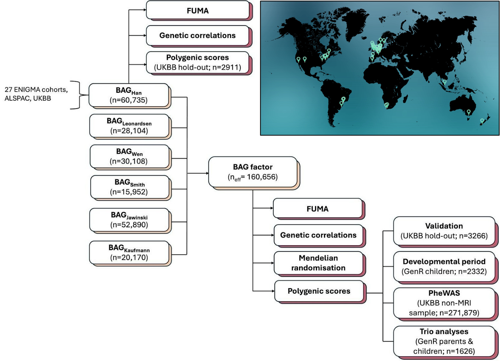

# Genetic architecture of brain age gap

This repository contains scripts and workflows for estimating **brain age gaps (BAG)**, performing **GWAS** in individual cohorts, **meta-analysing GWAS summary statistics**, running **genetic correlations**, **Mendelian randomisation**, and **polygenic score analyses**.  

---

## Overview

  
*Figure: High-level overview of the analysis workflow. Light brown boxes represent genome-wide association studies (GWASs). Maroon boxes represent post-GWAS analyses. Summary statistics for BAGHan have been obtained as part of the present study. Summary statistics for BAGLeonardsen, BAGWen, BAGSmith, BAGJawinski, and BAGKaufmann have been obtained from previously published studies. The map in the top-right shows the global representation of cohorts in BAGHan GWAS, with pins indicating the cities where each cohort is based. BAG = brain age gap; PheWAS = phenome-wide association study; UKBB = UK Biobank; GenR = Generation R study.*

---

## Repository structure

| Folder | Description |
|--------|-------------|
| `0.run-cohort-level-enigma-GWAS` | Scripts for deriving Han’s BAG phenotype and running GWAS in individual cohorts |
| `1.format-cohort-level-enigma-sumstats` | Formatting and QC of GWAS summary statistics |
| `2.metal-GWAS-meta-analysis-enigma` | METAL-based meta-analysis of ENIGMA GWAS (BAG Han) |
| `3.genomic-SEM-6-BAGs` | Genomic structural equation modeling of six BAG GWASs |
| `4.ldsc-BAGfactor` | LDSC regression between BAG factor and 30+ other traits |
| `5.ldsc-BAGHan` | LDSC analyses specifically for Han (ENIGMA) BAG |
| `6.Mendelian-randomisation` | Forward and reverse Mendelian randomisation analyses |
| `7.polygenic-scores` | Scripts to derive polygenic scores in independent cohorts |
| `plots` | Example plotting scripts for GWAS, PGS, and MR results |

---

## Notes

- Complementary UK Biobank–specific brain age workflows: [pjawinski/enigma_brainage](https://github.com/pjawinski/enigma_brainage).
