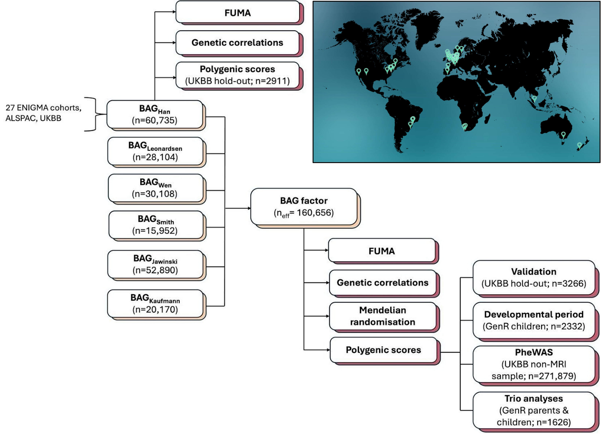
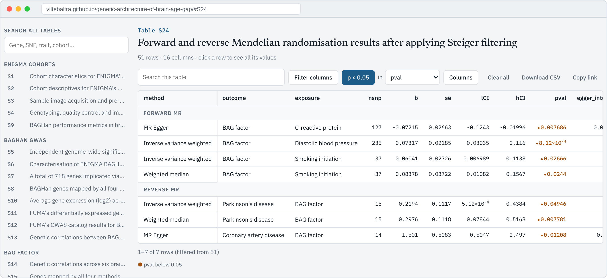

# Genetic architecture of brain age gap

This repository contains scripts and workflows for estimating **brain age gaps (BAG)**, performing **GWAS** in individual cohorts, **meta-analysing GWAS summary statistics**, running **genetic correlations**, **Mendelian randomisation**, and **polygenic score analyses**.  

**Supplementary tables:** browse, search and download them interactively at [viltebaltra.github.io/genetic-architecture-of-brain-age-gap](https://viltebaltra.github.io/genetic-architecture-of-brain-age-gap/).

---

## Overview

  
*Figure: High-level overview of the analysis workflow. Light brown boxes represent genome-wide association studies (GWASs). Maroon boxes represent post-GWAS analyses. Summary statistics for BAGHan have been obtained as part of the present study. Summary statistics for BAGLeonardsen, BAGWen, BAGSmith, BAGJawinski, and BAGKaufmann have been obtained from previously published studies. The map in the top-right shows the global representation of cohorts in BAGHan GWAS, with pins indicating the cities where each cohort is based. BAG = brain age gap; PheWAS = phenome-wide association study; UKBB = UK Biobank; GenR = Generation R study.*

---

## Interactive supplementary tables

All supplementary tables from the paper are available as a searchable website. You can search across every table at once (for a gene, SNP, trait or cohort), sort and filter columns, keep only rows with p < 0.05, link directly to a table (for example [`#S24`](https://viltebaltra.github.io/genetic-architecture-of-brain-age-gap/#S24)), and download any table as CSV or the full workbook as Excel.

---

## Repository structure

| Folder | Description |
|--------|-------------|
| `0.run-cohort-level-enigma-GWAS` | Scripts for deriving Han’s BAG phenotype and running GWAS in individual cohorts |
| `1.format-cohort-level-enigma-sumstats` | Formatting and QC of GWAS summary statistics |
| `2.metal-GWAS-meta-analysis-enigma` | METAL-based meta-analysis of ENIGMA GWAS (BAG Han) |
| `3.genomic-SEM-6-BAGs` | Genomic structural equation modeling of six BAG GWASs |
| `4.ldsc-BAGfactor` | LDSC regression between BAG factor and 30+ other traits |
| `5.ldsc-BAGHan` | LDSC analyses specifically for Han (ENIGMA) BAG |
| `6.Mendelian-randomisation` | Forward and reverse Mendelian randomisation analyses |
| `7.polygenic-scores` | Scripts to derive polygenic scores in independent cohorts |
| `plots` | Example plotting scripts for GWAS, PGS, and MR results |
| `docs` | Interactive supplementary tables website (served by GitHub Pages) |
| `scripts` | `build_supp_tables.py` converts the supplementary tables workbook into the website's data |

---

## Notes

- Complementary UK Biobank–specific brain age workflows: [pjawinski/enigma_brainage](https://github.com/pjawinski/enigma_brainage).
